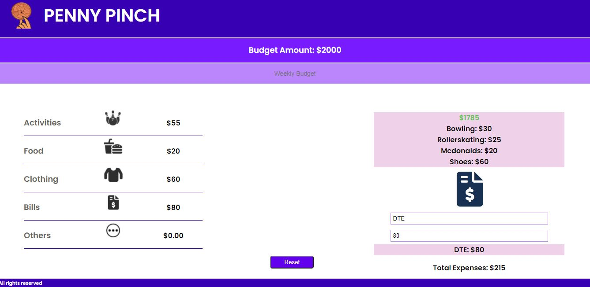
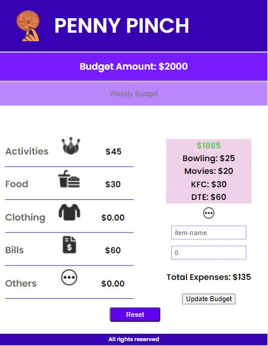

=== Penny Pinch ===

Contibutors: Nazima Taj, Allison Kohler, Bryan Feliciano, Zach Herdrich

--Description--

Penny Pinch is a simple and easy to understand budget app to help the everyday spender take charge of their finances. The user will input a specific amount of money for their budget, and as they spend, their expenses will be added into different categories. This helps the user determine how much, and where their money is being spent.

-Web View-

-Mobile View-

